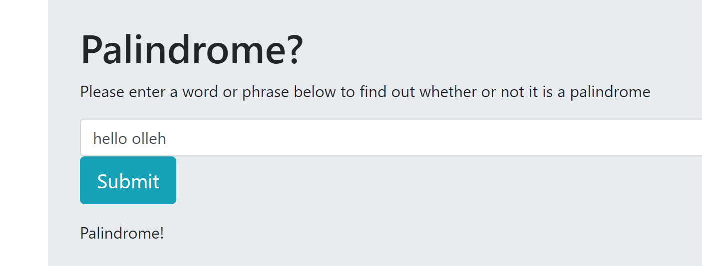

# _Palindrome Test_

#### _Tests whether or not a word or phrase is a palindrome, January 27, 2008_

#### By _**Mike B Lambert**_

## Description

_Enter a word or phrase into the input form and the program will return whether or not the word or phrase is a palindrome._

## Setup/Installation Requirements

* _Run in browser_

## Support and contact details

_Reach out to me at mlamb128@gmail.com_

## Technologies Used

_HTML, CSS, Javascript, and jQuery_

### License

*MIT License*

Copyright (c) 2018 **_Mike B Lambert_**
